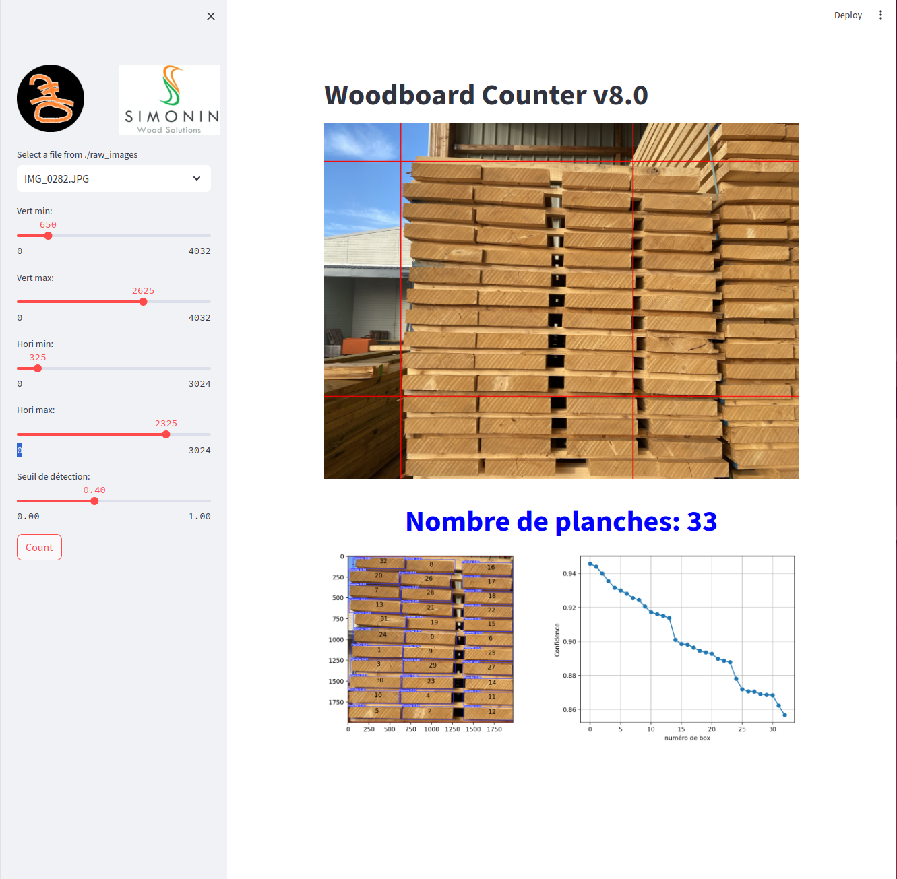

# Board_Counter

This github repo is a a Supervised Machine Learning Project to deploy a computer vision Application capable of counting the number of woodboards on an image.

It goes through all steps of a machine learning project, using different tools:

- **Jupyterlab** notebook to prepare images
- **Roboflow** to annotate images
- **Ultralytics Yolov8** to train model on specific images
- **Streamlit** to deploy a user interface
- **Docker** to create and deploy a container running this app on other computer

  You can pull the docker image with this commande *docker pull nimodeyv2868/board_counter_streamlit*

  

